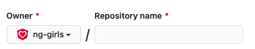

# Add your app to GitHub

## GitHub

[GitHub](https://github.com/) is a code repository website, which integrates with Git. It allows you to publish your project on the Web, copy \(fork and clone\) other open source projects and collaborate. To be able to publish your project, make sure you [create a user on GitHub](https://github.com/signup) \(for free, of course\).

There are several ways to add a project to your GitHub account. You can fork a project from another organization, create a new one from within the GitHub platform and clone it to your local machine, or create a project locally and upload it as a new GitHub repository. Since we've created the front-end app locally, we will upload it to a new repository.

> If you're forking a project that is deployed on Static Web Apps, make sure to delete the workflow file which is connected to the original repository. Otherwise, you will have failing actions.

### Creating a GitHub user

If you already have a GitHub user you can skip this step. To create a GitHub user go to [GitHub's super-cool sign up page](https://github.com/signup). Fill in the details and make sure to validate your email address.

### Creating a new repository for your project

Once you've signed in to GitHub, [create a new repository](https://github.com/new) to host your Angular app. \(Click on the link here, or on GitHub click on the + sign next to your avatar and select "New repository".\) **Give your repository a name.** It can be the same name as your Angular project, i.e. `todo-list` or `ng-girls-todo-list` .


We recommend using lowercase letters in the repository name. Some services that connect to GitHub that you may use later are case sensitive - so it's the best to use lowercase letters in repository name.


### Connecting your repository



**Select whether the repository is private or public.** If it's private, you'll be able to add collaborators who can see your code. You can change your decision later. However, a public repository may be forked \(duplicated by someone else\) and you'll have no control over the forks that were made. _This shouldn't stop you from making the repository public, as many projects are. Just make sure not to put any secret keys and codes in the project._


Don't add any templates or files. **Click on the button "Create repository".**


### Upload the todo-list project to the repository

You have several options to set up the repository. You have already created the project on your computer, so the relevant option is to **push an existing repository from the command line**. Copy the commands starting with `git` \(you can click the "copy" button on the right side to copy all the commands\) and paste into the terminal that's open in your project folder. \(You don't have to paste line by line. You can copy all three lines and paste them. The commands will run one after the other, except the last one where you'll have to hit Enter.\)


#### What do these commands do?

The first command, `git remote add origin...` connects the project to the GitHub repository you have created. It configures the **remote** location of the project, so that each time you sync the code \(push changes to the remote or pull from it\) you don't need to specify the remote explicitly.

The second command, `git branch -M main` renames the default branch from `master` to `main`, since it has become the new standard to name it.

The third command, `git push -u origin main` pushes the code from the main branch to the GitHub repository using the configuration of the `origin` as you have set in the first command.

Now you can go back to the browser where you have created your repository and refresh it. You will see the files and directories of your project, and below the contents of the README file that was generated by the Angular-CLI.

### Pushing changes to GitHub

Whenever you have finished a feature and the application seems to be working well, it's a good time to commit your changes locally and push them to GitHub to sync the repository. It is usually recommended to work on the code on different branches, then sync them with the main branch. However, for the simplicity of this tutorial you may work directly on the main branch.

**Add new files to git** - when you create new files, git doesn't include them automatically. You can notice that new files appear in red in the file list in the IDE. Run the following command to add all the files that were created in the project folder and subfolders. \(The dot `.` represents the current location. Alternatively, you can specify a file.\)

```text
git add .
```

This is equivalent to `git add --all` or `git add -A`.

Alternatively, use the IDE to add the files when committing.

**Commit the changes** - this is like hitting "save" on your project, with the ability to go backward and forward between the commits. \(Yes, time traveling!!\) This is useful in many ways, one of which is when you discover a new bug and want to go back or compare to a previous version.

You can either run a commit command in the terminal and supply a commit message:

```text
git commit -m "your commit message where you describe what has changed"
```

Or use your IDE to which supports the commit process. With the IDE you can see which files have changed, select the ones you want to commit or ignore, compare the changes with the last commit, edit the commit message, and more.

Find out how to commit \(and generally use git\) from your IDE:

* [Instructions for VS-Code](https://code.visualstudio.com/docs/editor/versioncontrol/?WT.mc_id=javascript-38439-shjacobs)
* [Instructions for WebStorm](https://www.jetbrains.com/help/webstorm/commit-and-push-changes.html) \(shortcut - Ctrl+K or Command+K\)

You can find instructions and conventions for writing good commit messages on the web. For example, [https://www.freecodecamp.org/news/a-beginners-guide-to-git-how-to-write-a-good-commit-message/](https://www.freecodecamp.org/news/a-beginners-guide-to-git-how-to-write-a-good-commit-message/)

**Push the changes to GitHub** - run the command

```text
git push
```

\(If you're on a new branch, the command will fail with instructions to open a branch of the same name on the remote repository. Just copy-paste the command.\) You can also use the IDE to push.

Check out your repository to see the changes!

### Pulling changes from GitHub

If changes were made from a different computer \(another collaborator, service, or your other computer\) and synced to GitHub, you must pull the changes to your local repository before being able to push additional changes to the same branch \(main or any branch you're working on\). You can also pull changes that were made on different branches and check them out on your computer. Simply run the following command \(and hope that there aren't any conflicts to resolve and merge!\)

```text
git pull
```


To work on a separate branch, use the following commands:  
`git checkout -b new-branch-name` - create a new branch and switch to it  
`git checkout main` - switch back to the main branch \(use `git checkout` to switch to any existing branch\)  
After committing your changes in the branch, you can push them to GitHub and create a Pull Request. There you'll be able to review the changes, discuss them, comment directly on the code snippets, push additional changes, and finally approve the pull request and merge it to main. Then, sync your local main branch by running `git pull`.

If you're working in collaboration with other contributors, you may need to merge their work and rebase the commits.


### More on Git and GitHub

There are many more features on Git and GitHub. \(One of my favorites is git rebase!\) As you go forward with your project, and especially collaborate with teammates, you will get to learn more commands and useful workflows.

